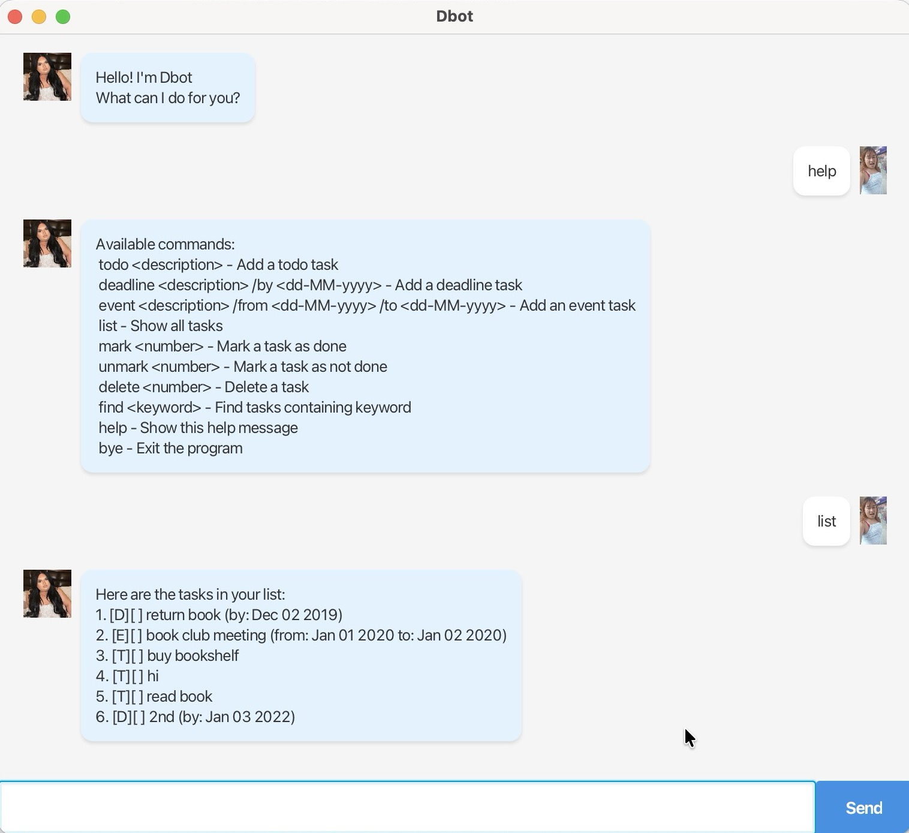

# Dbot User Guide

Dbot is a desktop task manager that helps you keep track of todos, deadlines, and events.

## Quick Start

1. Ensure you have Java `17` or above installed.
2. Download the latest `dbot.jar` from [here](https://github.com/DamianNgWZ/ip/releases).
3. Double-click the jar file or run `java -jar dbot.jar` in terminal.
4. Type commands in the text box and press Enter.

## Features

### Adding a todo: `todo`

Adds a simple task.

Format: `todo DESCRIPTION`

Example: `todo read book`

### Adding a deadline: `deadline`

Adds a task with a due date.

Format: `deadline DESCRIPTION /by DATE`

* Date format: `dd-MM-yyyy` (e.g., `15-02-2026`)

Example: `deadline submit report /by 15-02-2026`

### Adding an event: `event`

Adds a task with start and end dates.

Format: `event DESCRIPTION /from START_DATE /to END_DATE`

* Date format: `dd-MM-yyyy`

Example: `event project meeting /from 12-02-2026 /to 12-02-2026`

### Listing all tasks: `list`

Shows all your tasks.

Format: `list`

### Finding tasks: `find`

Finds tasks containing a keyword.

Format: `find KEYWORD`

Example: `find book`

### Marking a task as done: `mark`

Marks a task as completed.

Format: `mark INDEX`

Example: `mark 1`

### Unmarking a task: `unmark`

Marks a task as not done.

Format: `unmark INDEX`

Example: `unmark 1`

### Deleting a task: `delete`

Removes a task.

Format: `delete INDEX`

Example: `delete 2`

### Sorting tasks: `sort`

Sorts tasks by date (deadlines and events first, then todos).

Format: `sort`

### Getting help: `help`

Shows available commands.

Format: `help`

### Exiting: `bye`

Closes the app.

Format: `bye`

## Command Summary

| Command | Format | Example |
|---------|--------|---------|
| Add Todo | `todo DESCRIPTION` | `todo read book` |
| Add Deadline | `deadline DESCRIPTION /by DATE` | `deadline report /by 15-02-2026` |
| Add Event | `event DESCRIPTION /from DATE /to DATE` | `event meeting /from 12-02-2026 /to 12-02-2026` |
| List | `list` | `list` |
| Find | `find KEYWORD` | `find book` |
| Mark | `mark INDEX` | `mark 1` |
| Unmark | `unmark INDEX` | `unmark 1` |
| Delete | `delete INDEX` | `delete 2` |
| Sort | `sort` | `sort` |
| Help | `help` | `help` |
| Exit | `bye` | `bye` |

## Notes

* Dates must be in `dd-MM-yyyy` format
* Tasks are automatically saved to `./data/dbot.txt`
* Task status: `[T]` = Todo, `[D]` = Deadline, `[E]` = Event, `[ ]` = Not done, `[X]` = Done
